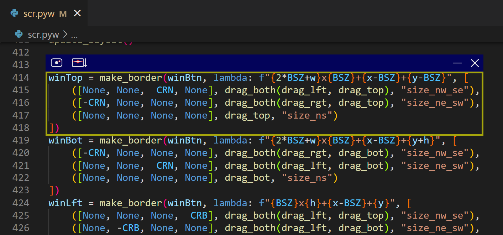

# ScrollRec
Create large screenshots by scrolling

<i>ScrollRec in action</i>

| Button | Function |
|-|-|
|  | take a simple screenshot |
|  | take a stitched screenshot by scrolling in the vertical direction |
